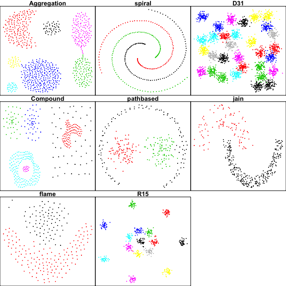

<!-- README.md is generated from README.Rmd. Please edit that file -->
Clustering Datasets
-------------------

An R-repackaging of datasets useful for evaluating clustering methods. The source for most is <http://cs.joensuu.fi/sipu/datasets>

I would love to include additional clustering datasets, if folks would like to provide them or make a PR.

Clustering Datasets
-------------------

This vignette provides a simple overview of the datasets included in the package.

### Birch

### S Sets

The S-sets are useful for testing how an algorithm handles cluster overlap.

### A Sets

### Shapesets

### Chameleon

### Neural Gas

### Non-Convex

Locations
---------

High Dimensional Datasets
-------------------------

The package contains three sets of high-dimensional data. The visualizations below were made using my `largeVis` package to reduce each dataset to two dimensions, and the colors are the result of applying the `hdbscan` function within the package.

### UCI Datasets

### KDDCUP04Bio

